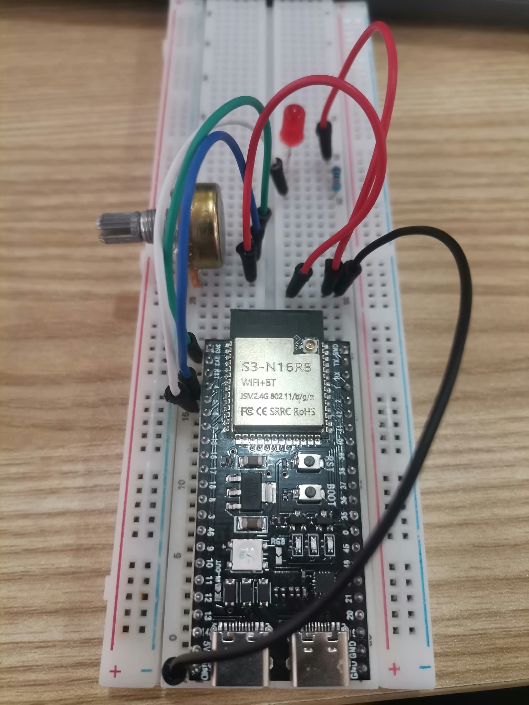
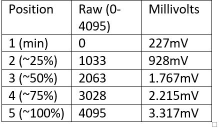
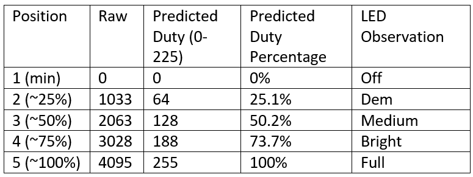
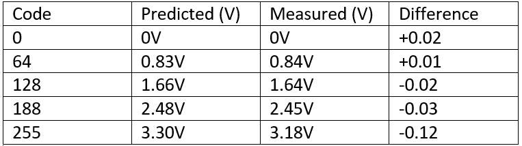

# ESP32 Lab: ADC vs PWM vs DAC

**Board:** ESP32 DevKit (original ESP32)
**Arduino core version:** 3.x
**Equipment:** multimeter [digital], oscilloscope [no]

## Wiring
- Pot: 3V3 / GPIO4 (wiper) / GND
- LED: GPIO5 -> 220 ohm -> LED -> GND
- DAC: GPIO25 using the classic ESP32

## Table 1: Potentiometer readings (Sketch 1)

## Table 2: PWM duty (Sketch 2)

## Table 3: DAC measurements (Sketch 3, GPIO25)

## Predicted vs observed
(The predicted PWM values were 0, 64, 128, 188, and 255, and the Serial Monitor values matched them. The LED was off at the lowest value and became brighter as the duty increased. The DAC voltage was also close to the predicted values, with small differences because of the multimeter, 3.3 V supply, and DAC accuracy. The ADC reading was near 0 at minimum and around 4095 at maximum.)

## Why PWM is not a DAC
(PWM only switches between 0 V and 3.3 V. It changes brightness by changing the ON and OFF time. A DAC can produce a steady voltage, while PWM only gives an average voltage. A resistor and capacitor filter can make PWM smoother.)

## Why the ADC endpoint may saturate
(The ESP32 ADC can reach around 4095 when the input gets near its limit. After this point, the reading may stop increasing even if the voltage increases. This is called saturation. analogReadMilliVolts() is more accurate because it uses calibration.)

## Demo video
[Watch the demo](demo.mp4)
